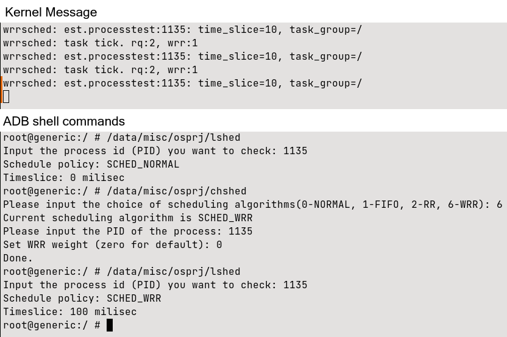
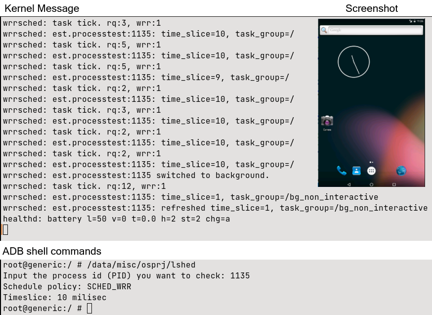
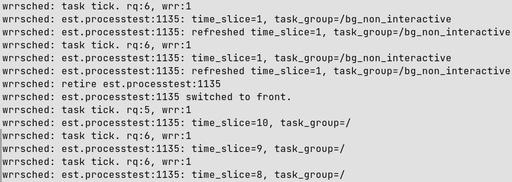
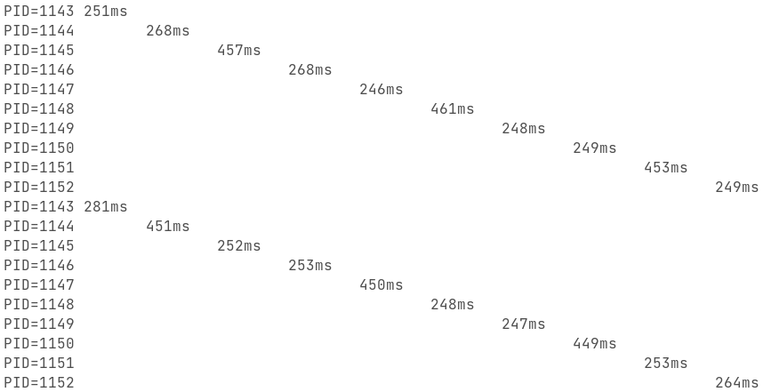
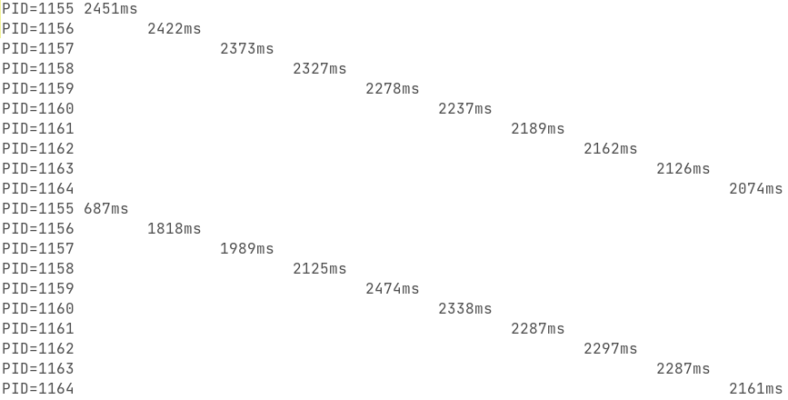
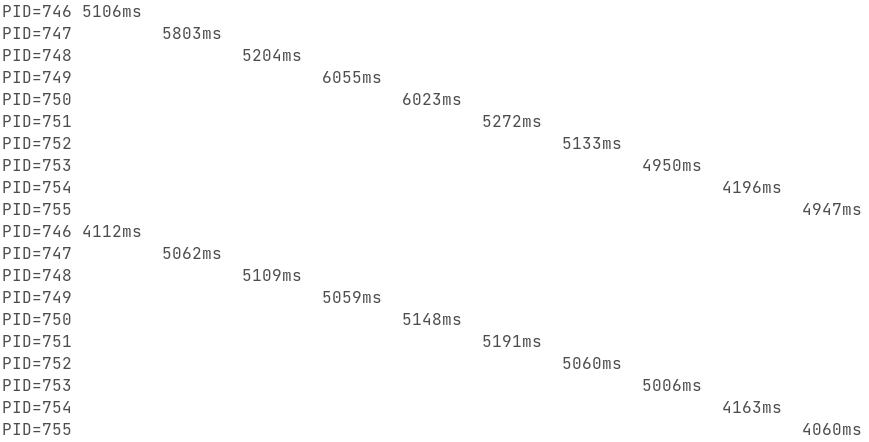
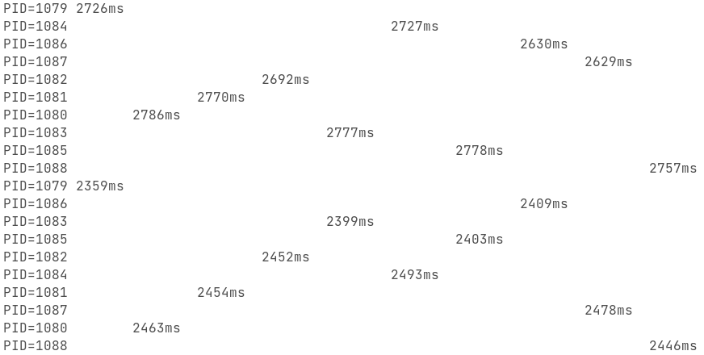
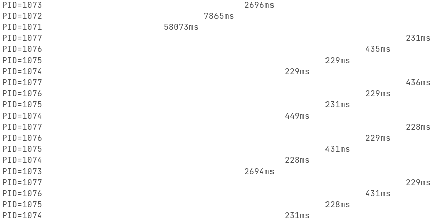
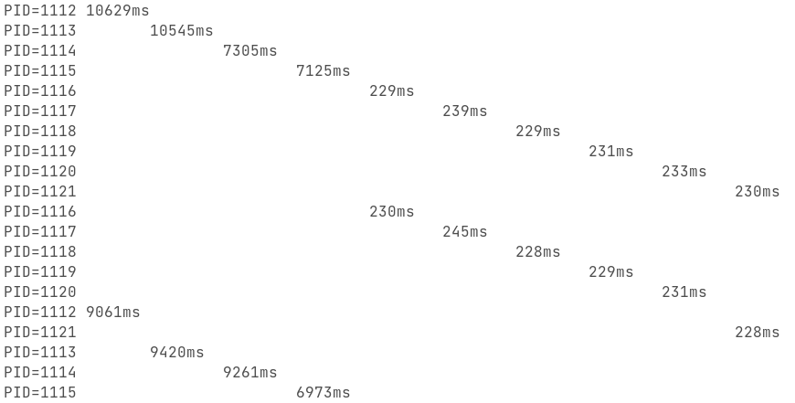

# Report: Weighted Round-Robin scheduler

## Introduction

CPU scheduling is the basis of multiprogrammed operating systems. By switching the CPU among processes, the operating system can make the computer more productive[quote here: OSC, 8th, 183]. The Linux kernel, and the Android OS built on top of it, uses both First-in-First-out (**FIFO**) queuing and round robin (**RR**) strategies to build its real-time tasks scheduler, and the completely fair scheduling (**CFS**) algorithm to build its default task scheduler. We implement here a weighted round robin (**WRR**) scheduler and compare the typical features of different schedulers.

As in the original requirement, our implementation of the WRR scheduler sets the scheduling weights and time slices only according to whether it is a foreground or a background application. However, the distinction does not bring out the true power of the WRR scheduler, so we modified it by making a system call that allows the task weights to be modified, and demonstrated this in the scheduler comparison.

We also implemented several utilities to help us inspect and change scheduling policies. To provide an image of the comparison between schedulers, we have also written a process testing tool.

## Analysis and Implementation

### `wrr.c`, the scheduler

In order to design our scheduler, we first studied the scheduler mechanism of linux. We found that linux uses the `sched_class` structure to implement the scheduler in order to abstract different scheduling mechanism. Therefore, our scheduler implementation is mainly to implement the `sched_class` structure of the `WRR` scheduler, which is mainly in `kernel/sched/wrr.c`. To provide better structured information, we have also added a header file `kernel/sched/wrr.h` that is only referenced in `wrr.c`.

In the requirements, we do not need to implement SMP, i.e. the symmetric multiprocessor architecture, so we ignore all SMP-related contents when implementing. In addition, our WRR here is more oriented to scheduling common tasks than RT scheduler scheduling real-time tasks, and in the requirements we also set the weights through the task group mechanism, so instead of using the task group and group inheritance scheduling structure like the real-time tasks, we use an overall round robin mechanism, and each polling will be selected among all tasks that use the WRR scheduling mechanism.

Our WRR structure here requires the use of task groups to distinguish between the foreground and background. Therefore, we refer to the relevant function `task_group_path()` in the `debug.c` file to get the task group name and thus determine the foreground and background. In this implementation, the weight is updated every time it happens to enqueue or dequeue, and when the time slice is being refreshed.

The main implementation of the rest of the content refers to the original real-time scheduler section. However, we do not need the part of the real-time scheduler about priority, so instead of using a bitmap structure, we operate directly on a list. This (list) operation process is also reflected in the real-time scheduler, because in fact the real-time scheduler also contains the round robin scheduling algorithm.

### Embedding into the system

In order to add our WRR scheduler to the kernel, we need to make some adjustments to the original system content.

- Compile Flags

    We introduced a new compile flag `CONFIG_WRR_GROUP_SCHED`, which will automatically generated into a header file at compile time and define the `CONFIG_WRR_GROUP_SCHED` macro. Add this option to the `init/Kconfig` file and add `CONFIG_WRR_GROUP_SCHED=y` to the `arch/arm/configs/goldfish_armv7_defconfig` file so that this macro is defined.

    We have introduced a number of debugging statements at the time of coding and they are all defined under the `CONFIG_SCHED_DEBUG` macro. However, these printing operations cause a lot of extra overhead for the scheduler, so we created a new file `arch/arm/configs/goldfish_armv7_nodebug_defconfig` here to disable it and save the overhead. The `task_group_path()` mentioned above also needs to be adjusted at this point, as removing this macro will make a function from `autogroup.h` invalid.

- Linux header files

    We adjusted `include/linux/sched.h` to define the `SCHED_WRR` macro identifier and some values for weights and time slices. We declared `wrr_rq` as `rt_rq` do.

    we also defined `sched_wrr_entity` structure to store necessary information for each WRR task: a link_head `run_list` for WRR task queueing, `time_slice` and `weight` for weighting and time slice counting. After defining we added an instance `wrr` into `task_struct`.

- Scheduler Makefile

    Added `wrr.o` to link our `wrr.c` into the scheduler.

- Scheduler `rt.c`

    Set the next scheduler of the RT scheduler to be the WRR scheduler (originally it would be the CFS scheduler), so that the main scheduler will be scheduled in the order RT - WRR - CFS.

- Scheduler `core.c`

    Added the time slice update and weight update related operation functions for WRR. Since other schedulers do not set the weights in WRR, we need this function to set them when switching schedulers.

    We initialize lists of WRR, allowable values, etc., just like the RT do. `core.c` has a common judgment: if it is a real-time task, set it to `rt_sched_class`, otherwise set it to `fair_sched_class`. We use the `policy` value of the task to determine this and set the task with the WRR policy to `wrr_sched_class`.

    We refine the judgment of the value of `policy` in the related function of the task scheduler switching.
    
- Scheduler `sched.h`

    defined struct `wrr_rq`, which is the running queue of WRR. the list_head `active` points to the head of the queue of `sched_wrr_entity`, and `wrr_nr_running` indicates the running task number in the WRR queue.

### Testing utilities

In order to test the scheduler more easily, we wrote two utilities `lshed` and `chshed`. By using the system calls `sched_setscheduler` and `sched_rr_get_interval`, the former can output the used scheduler and time slice information based on the input PID, and the latter can change the scheduler and scheduling parameters for a specific PID.

Since the given `processtest.apk` is not very comprehensive in what it tests, we also wrote a `proctest` test program that forks a specified number of test processes and specifies their schedulers and scheduling parameters. The test process simulates a common CPU burst / IO burst loop, waiting for a certain number of seconds (simulates an IO waiting) after a large number of adding loop (which is a CPU burst), and print out the loop time.

## Test Results

Here we test with the provided file `processtest.apk`. We use the utility `lshed` and `chshed` mentioned above to manipulate the scheduler.

Here we changed the `processtest` application from foreground to background, by clicking the home button, and here are the results. We may read from `lshed` result that the new time slice is set to 10 ms. We may see from the figure below that in some rounds the time_slice did not decrease. This is because the time slice is refreshed when the task is rejoined. Here, because the program performs a short refresh action, it does not use up a tick (10ms) before re-entering the wait state and exiting the queue. A more complete scheduling process can be observed in the next figure.

And when we switched from background to foreground by android application switcher, you may see that the time_slice is updated to 10, which indicates 100 ms, as 10 ms for a time tick. 

## Additional Part

### Throttle Mechanism

Because the main scheduler is scheduled sequentially, i.e. the later scheduler will be called only when the previous one has finished scheduling. Therefore, when intensive tasks are executed with WRR policy, it will be difficult for the CFS scheduler immediately after it to get time for running. Since the vast majority of the system's tasks, including `adb`, display, and control, are executed under the CFS scheduler, this will make the entire virtual machine not responding.

Following the example of the throttle mechanism in the real-time scheduler, we have introduced this mechanism in the WRR scheduler to share more runtime with other schedulers (i.e. CFS scheduler).

### Adjustable Weight

There are many programs, especially those executing on the linux level (the other example is the android level), that do not use task groups to distinguish themselves. For example, the android debug bridge, and all programs forked from the adb shell, behave as so-called foreground programs. This degrades the WRR scheduler to a normal RR scheduler in most situations.

Therefore we modified the implementation functions behind the `sched_setscheduler` and `sched_setparam` system calls, and also modified `sched_wrr_entity` appropriately to enable flexible adjustment of the weights. Since the `sched_param` structure is defined in the GNU C library and not in the kernel, it is difficult to adjust the contents of this structure, so we have reused the priority in the configuration real-time task. Setting this value to a non-negative value manually adjusts the weight of the task, while setting it to 0 restores the original weighting convention.

This feature is critical to utilize the WRR scheduler’s full ability, and is applied in the comparison of scheduler features that follows.

### Scheduler Comparison

We now compare the scheduler implemented in Linux with the scheduler we wrote to analyze their typical features and similarities. Linux scheduler seems to have a wide range of six scheduling strategies, but in fact there are only three: FIFO scheduling, RR scheduling and CFS scheduling (although Deadline scheduling was introduced later in the Linux kernel, the 3.4.67 kernel used in the experiment does not have this scheduling method). Here we discuss the performance of each scheduler with the same priority (or weight) and with different priorities (or weights). *Since the priority of CFS is more complex and not directly related to the set value, we will only discuss the performance of CFS under the same priority.*

**Scheduling with the same priority**

The conclusions for RR scheduling and FIFO scheduling, when the priorities are the same, are trivial. Because the same policy is used, these scheduling methods are consistent with the result that each process has the same weight in WRR scheduling. Unlike CFS scheduling, which executes out-of-order because of using the red-black tree as organizational structure, these scheduling algorithms remains a good sequential order. The main difference is performance.

Our test program is set to 10 processes, and for WRR scheduling the weight is set to the default weight of the foreground program (i.e. 100 ms, the same as RR scheduling).

| Scheduler    | FIFO   | RR      | CFS          | WRR     |
| ------------ | ------ | ------- | ------------ | ------- |
| Approx. Time | 250 ms | 2000 ms | 2500/4500 ms | 4500 ms |

Because of the different scheduling algorithms adopted and the different priorities (meaning the priority of the scheduler), we observe that the FIFO scheduler takes the shortest time per loop. Once the FIFO scheduler is running it is not preempted by programs of the same or lower priority, and we can interpret this value as the time to run centrally.

The time of the RR scheduler grows significantly, but it actually meets our expectation. 100 ms is the length of the RR time slice, which means that the previous 250 ms will be divided into three time slice executions. The average time taken by the RR scheduler is around 2000 ms, which is as expected.

For WRR scheduling, because of the throttle mechanism implemented in the previous section, WRR scheduling leaves 50% of the time for the CFS scheduler. Coupled with the fact that WRR scheduling runs after real-time tasks with lower priority, such time spent is reasonable.

We can observe that the time variance for CFS is smaller and it completes faster (about 2500 ms). (This is because the WRR scheduler is in idle state. When we block the WRR scheduler, the CFS scheduler takes a similar amount of time as the WRR scheduler, but the time gap is still smaller than the WRR scheduler.) The CFS scheduler, as the default scheduler for Linux, shows its advantages of stability and efficiency.

**Scheduling with different priorities**

It is easy to know that FIFO scheduling at different priority levels tends to cause starvation of lower priority programs. But the RR scheduling used in real-time scheduling does not bring any improvement either, because the low-priority programs in the real-time scheduler do not run while the high-priority programs is running (That’s why the real-time task scheduler provides  throttling  to reserve some runtime to the waiting successor scheduler and the low-priority processes). FIFO scheduling and RR scheduling performed in the same behavior. Thus both exhibit low priority processes being starved to death. We see that the process in seventh place of the priority list takes a minute to complete a cycle, and the three processes further down have never output from the start.

Our WRR scheduler then shows the advantage of starvation-free. And because the time slice setting is increased, more processes are able to run undisturbed (with similar performance to FIFO scheduling in same priority scheduling), and the lower priority processes do not wait too long. The process at the beginning of the line (i.e. the one with the shortest time slice) has a time slice of only 150 ms, but still manages to finish in about ten seconds. There is no starvation of the program. This is determined by the stack characteristics of WRR.

## Conclusion

Through this project, I have gained a deeper understanding of the scheduler in the linux kernel. By combining kernel-level programming with application-level programming, I gradually understood their similarities and differences. It was especially gratifying to see that my additions to the kernel could be performed and called correctly by the outer programs. From understanding the implementation of a large project, to editing, compiling and debugging it, them all forms a great challenge which could not be found in past practical courses, and I think this project is very practical and instructive for future programming practice.

